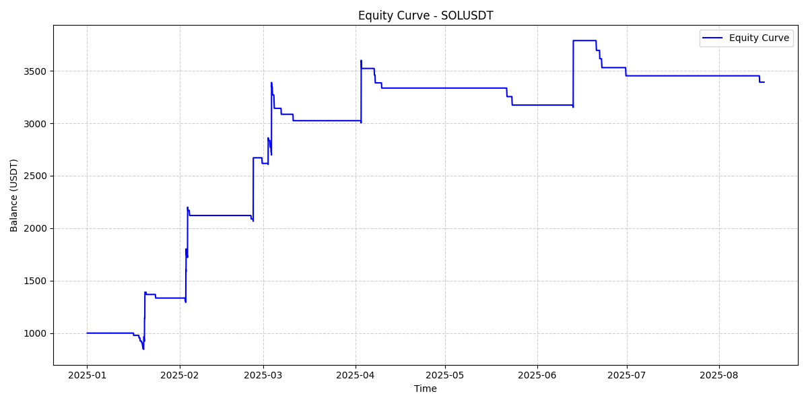

This is for my Personal Project on Many Strategies used in Crypto Trading. 
Mange my own crypto-trading strategies and algorithms in my own protfolio.
Most of the strategies are based on Mathematical and Statical Models.
Working every day is a Fun.
Let see more on it

<h align="center">It's just a simple strategy on 1H Time frame on Biinance</h>

